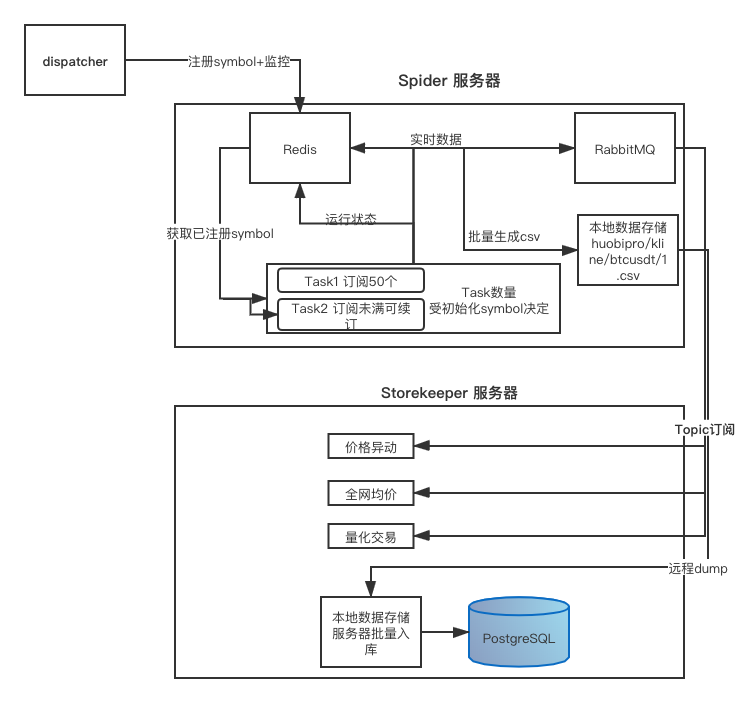

## 设计目标：

- 开箱即用、灵活部署（可以快速部署到任何一台 Linux 服务器）
- 抓取数据连续、完整、不丢数据
- 抓取运行状态清晰、可控
- 常见问题自动修复
- 实时数据抓取 Trade(Websocket+RESTful)，历史数据通过 RESTful 抓取不同 TimeFrame OHLCV
- OHLCV TimeFrame 覆盖最小 1min： 1min 3min 5min 10min 15min 30min 1h 2h 4h 6h 12h 1d 3d 1week 1month
- 按照交易/币种热门程度，执行不同的更新频率，有用户订阅的交易对更新最实时


## 抓取原则：

- 尽量抓取最小粒度的 TimeFrame，其他粒度通过最小粒度计算
- 不重复抓取，冗余的抓取只用作数据校验和回补


## 受限因素：

- 交易所可供查询历史数据有限
- AICoin 1min 覆盖度有限（只有最近1周）
- 交易所 API 访问频率有限制

## 使用方法：
- 请查看 [instructions.md](https://github.com/zhuchen0310/exspider/blob/master/Instructions.md)

## kline接口
- 点击查看kline返回数据： [huobipro btcusdt 1min kline](http://api.ihold.com/v2/coin/ohlcv?exchange=huobipro&symbol=btc_usdt&step=1min)
```
API: http://api.ihold.com/v2/coin/ohlcv?exchange=huobipro&symbol=btc_usdt&step=1min
请求方式: GET
说明:
            exchange    @: huobipro
            symbol      @: btc_usdt
            type        @: 初始为0, 更新为1, 左滑历史为:-1
            reach       @: 查询基准时间戳
                            type: 0 初始化, 不需要传;
                            type: 1 更新, 传最右侧 时间戳 更新所传时间戳之后的kline
                            type: -1 历史, 传最左侧 时间戳 则 返回 reach 之前 500 条数据,
            step        @: timeframe, 1min,5min,15min,30min,1hour,4hour,12hour,24hour,1day,1week,1month
            limit       @: 默认500条
```

## 主要模块：
- 架构示意图


- 爬虫（spider）
    - 连接 dispatch 注册
    - 接收 dispatcher 的指令
    - 通过 Websocket 实时抓取 Trade 数据
    - 通过 RESTful 抓取近期历史数据
    - 数据先存储在本地：本地文件 or leveldb 
    - 定期将本地数据上传至 storekeeper
    - 实时上报运行状态至 dispatcher：IP、Exchange、Pair List
    - 以 Docker 方式运行
- 中央控制器（dispatcher）
    - 未完全实现，TODO ZK来管理注册中心！
    - 统计 spider 运行状态
    - 将交易所抓取请求均摊到各个 spider
    - spider 运行出错时及时切换任务
    - 协调 IP / 服务器资源
    - Admin Dashboard：运行时间，spider 数量，IP 数量，交易所数量，交易对数量，K线条数，Trade条数
- 存储服务器（storekeeper）
    - 接收 spider 上传的数据，持久化存储
    - 根据数据热度存储到不同数据库（Redis、PostgreSQL、OSS）

